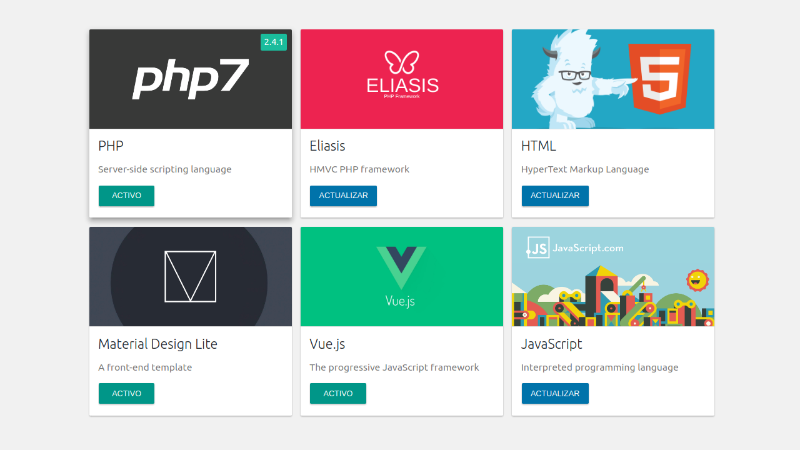

# Eliasis PHP Framework

       

[Versión en español](README-ES.md)

---

- [Requirements](#requirements)
- [Installation](#installation)
- [Documentation](#documentation)
- [Tests](#tests)
- [TODO](#-todo)
- [Contribute](#contribute)
- [License](#license)
- [Copyright](#copyright)

---

## Requirements

This framework is supported by **PHP versions 5.6** or higher and is compatible with **HHVM versions 3.0** or higher.

## Installation

You can install **Eliasis PHP Framework** into your project using [Composer](http://getcomposer.org/download/). If you're starting a new project, we
recommend using the [basic app](https://github.com/eliasis-framework/app) as
a starting point. For existing applications you can run the following:

    $ composer require Eliasis-Framework/Complement

The previous command will only install the necessary files, if you prefer to **download the entire source code** you can use:

    $ composer require Eliasis-Framework/Complement --prefer-source

## Documentation

[Documentation and examples of use](https://eliasis-framework.github.io/Complement/v1.1.1/lang/en/).

## Tests 

To run [tests](tests) you just need [composer](http://getcomposer.org/download/) and to execute the following:

    $ git clone https://github.com/Eliasis-Framework/Complement.git
    
    $ cd Eliasis

    $ composer install

Run unit tests with [PHPUnit](https://phpunit.de/):

    $ composer phpunit

Run [PSR2](http://www.php-fig.org/psr/psr-2/) code standard tests with [PHPCS](https://github.com/squizlabs/PHP_CodeSniffer):

    $ composer phpcs

Run [PHP Mess Detector](https://phpmd.org/) tests to detect inconsistencies in code style:

    $ composer phpmd

Run all previous tests:

    $ composer tests

## ☑ TODO

- [ ] Add new feature.
- [ ] Add tests for Vue.
- [ ] Improve PHP tests.
- [ ] Improve documentation.
- [ ] Refactor code for disabled code style rules. See [phpmd.xml](phpmd.xml) and [.php_cs.dist](.php_cs.dist).

## Contribute

If you would like to help, please take a look at the list of
[issues](https://github.com/Eliasis-Framework/Complement/issues) or the [To Do](#-todo) checklist.

**Pull requests**

* [Fork and clone](https://help.github.com/articles/fork-a-repo).
* Run the command `composer install` to install the dependencies.
  This will also install the [dev dependencies](https://getcomposer.org/doc/03-cli.md#install).
* Run the command `composer fix` to excute code standard fixers.
* Run the [tests](#tests).
* Create a **branch**, **commit**, **push** and send me a
  [pull request](https://help.github.com/articles/using-pull-requests).

## License

This project is licensed under **MIT license**. See the [LICENSE](LICENSE) file for more info.

## Copyright

2017 - 2018 Josantonius, [josantonius.com](https://josantonius.com/)

If you find it useful, let me know :wink:

You can contact me on [Twitter](https://twitter.com/Josantonius) or through my [email](mailto:hello@josantonius.com).